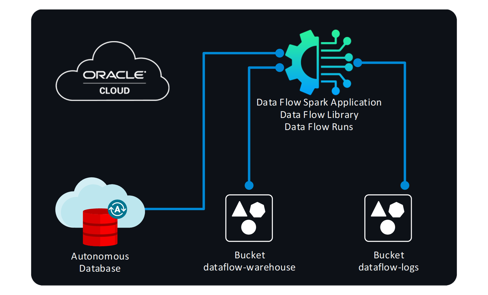
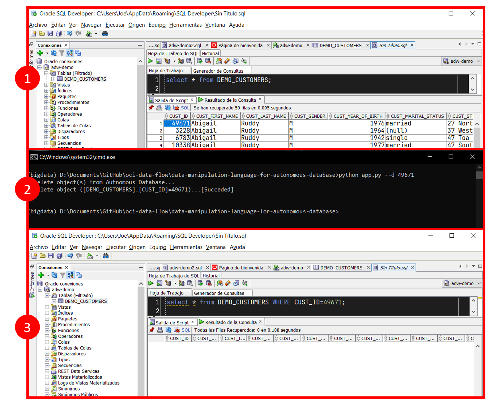

[![Issues][issues-shield]][issues-url]
[![LinkedIn][linkedin-shield]][linkedin-url]


<!-- PROJECT LOGO -->
<br />
<p align="center">
  

  <h3 align="center">OCI Data Flow</h3>

  <p align="center">
    Lenguaje de manipulación de datos (DML) para Autonomous Database
    <br />
    <a href="app.py"><strong>Explore the code »</strong></a>
    <br />
    <br />
    <a href="https://youtu.be/prc_qrCHIQA">🎬 View Demo</a>
    ·
    <a href="https://github.com/jganggini/oci/issues">Report Bug</a>
    ·
    <a href="https://github.com/jganggini/oci/issues">Request Feature</a>
  </p>
</p>


<!-- TABLE OF CONTENTS -->
<details open="open">
  <summary>Contenido</summary>
  <ol>
    <li><a href="#proyecto">Proyecto</a></li>
    <li>
        <a href="#descripción">Descripción</a>
        <ul>
            <li><a href="#config">Config</a></li>
            <li><a href="#parameters">Parameters</a></li>
        </ul>
    </li>
    <li><a href="#instalación">Instalación</a></li>
    <li><a href="#ejecución-local">Ejecución Local</a></li>
    <li><a href="#referencias">Referencias</a></li>
    <li><a href="#contacto">Contacto</a></li>
  </ol>
</details>

<!-- Proyecto -->
## Proyecto

El siguiente proyecto cubre la necesidad de relizar eliminaciones de datos en ADB con python para ser usado en un proceos Streaming.

Para ello les comparto el paso a paso de cómo llegar a hacer estas integraciones rápidas en PySpark gracias a los SDK sin necesidad de realizar mapeos o seguimiento de los directorios existentes.

El siguiente diagrama ilustra esta arquitectura de referencia:

<p align="center">
    
</p>


<!-- Config -->
## Config

Los SDK y la CLI de Oracle Cloud Infrastructure requieren información de configuración básica, como las credenciales de usuario y el OCID de arrendamiento. [SDK and CLI Configuration File](https://docs.oracle.com/en-us/iaas/Content/API/Concepts/sdkconfig.htm)


<!-- Instalación -->
## Instalación

*   Utilice el administrador de paquetes [pip](https://pip.pypa.io/en/stable/) para instalar las siguientes librerias:

    ```bash
    python -m pip install --upgrade pip
    pip install oci
    pip install cx_Oracle
    ```

*   Copiar todos los dlls del directorio D:\oracle\instantclient_19_16\*.dll a la carpeta de instalación de Python.


<!-- Ejecución Local-->
## Ejecución Local

*   `CMD`: Probamos nuestro código en local:

    ```cmd
    python app.py --d 49671
    ```

*   `CMD`: Esperamos que termine de ejecutar la aplicación.

    <p align="center">
      
    </p>

<!-- Referencias -->
## Referencias

*   [Oracle Cloud Infrastructure Documentation: SDK and CLI Configuration File:](https://docs.oracle.com/en-us/iaas/Content/API/Concepts/sdkconfig.htm)
*   [Oracle Cloud Infrastructure Documentation: put_object](https://docs.oracle.com/en-us/iaas/tools/python-sdk-examples/2.45.1/objectstorage/put_object.py.html)
*   [Oracle Cloud Infrastructure Documentation: Biblioteca de Data Flow](https://docs.oracle.com/es-ww/iaas/data-flow/using/dfs_data_flow_library.htm)


<!-- Contacto -->
## Contacto

* Joel Ganggini García - [@jganggini](https://www.linkedin.com/in/jganggini/)
* Project Link: [https://github.com/jganggini/oci](https://github.com/jganggini/oci)

<!-- MARKDOWN LINKS & IMAGES -->
<!-- https://www.markdownguide.org/basic-syntax/#reference-style-links -->
[issues-shield]: https://img.shields.io/github/issues/othneildrew/Best-README-Template.svg?style=for-the-badge
[issues-url]: https://github.com/jganggini/oci-data-flow/issues
[linkedin-shield]: https://img.shields.io/badge/-LinkedIn-black.svg?style=for-the-badge&logo=linkedin&colorB=555
[linkedin-url]: https://www.linkedin.com/in/jganggini/